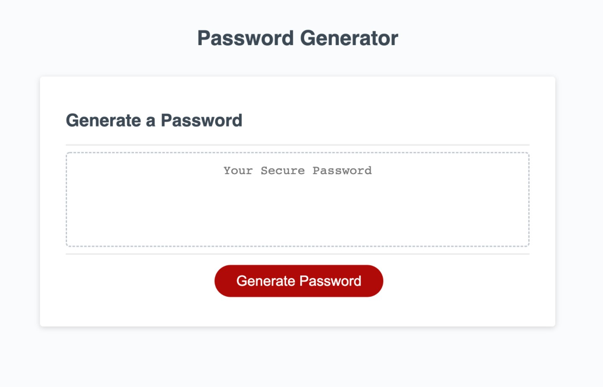
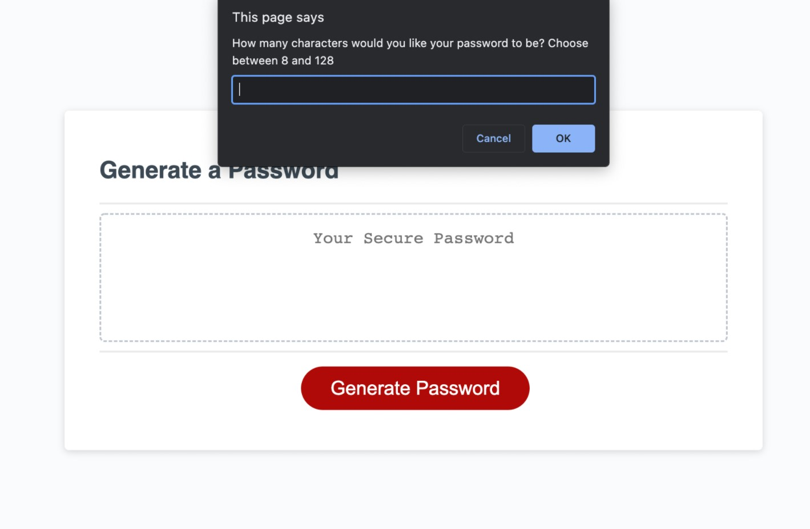
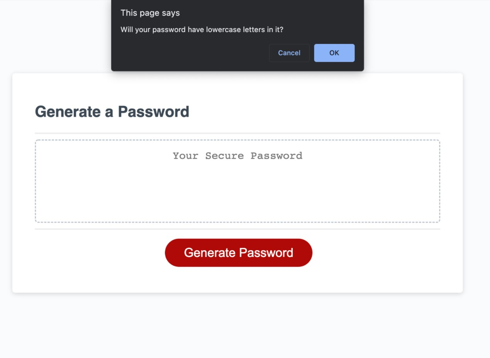

# Password Generator Starter Code

## Password Generator

### Purpose:

* To create a basic general password creator that will ask user questions and create a password based off their answers.

### Written with:
* HTML
* CSS
* JS

## Website:
https://nchan22.github.io/password-generator/

## Future Uses:
* Update from prompts to forms
* Update to allow user to choose which characters to randomize from
* Update to allow generator to create multiple passwords at once and allow user to choose from it
* Update to allow storage of possible passwords for user to access again

## Screenshots

## Contributors:
Original written by user Xandromus (https://github.com/coding-boot-camp/friendly-parakeet)

Edited by Nathaniel Chan
